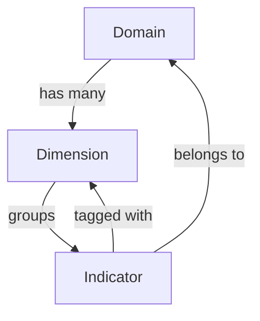

## What is a dimension?

A dimension (also referred to as a **subdomain**) is a named sub-category within a [domain](/concepts/domains). While domains represent broad thematic areas, dimensions provide finer-grained groupings that make it easier to navigate large sets of indicators.

For example, an **Environmental** domain might contain dimensions such as:

- Water
- Energy
- Biodiversity
- Air quality
- Waste

Each indicator is assigned to exactly one dimension within its domain. The combination of domain + dimension locates an indicator precisely within the platform's taxonomy.

## Dimensions in the data model

Dimensions are stored as part of the domain object. The `subdomains` array on a domain contains the list of dimension objects for that domain:

```json
{
  "id": "domain-123",
  "name": "Environmental",
  "subdomains": [
    { "name": "Water" },
    { "name": "Energy" },
    { "name": "Biodiversity" }
  ]
}
```

On the indicator object, the dimension is stored as the `subdomain` string field — the plain name of the dimension.

```json
{
  "id": "indicator-456",
  "name": "Annual freshwater consumption",
  "domain": { "id": "domain-123", "name": "Environmental" },
  "subdomain": "Water"
}
```

## Filtering by dimension

The indicator list supports filtering by dimension. The dimension filter dropdown:

- **Is disabled** when no domain is selected — dimensions are domain-specific, so a domain must be active first
- **Becomes enabled** when a domain is selected — the dropdown populates with that domain's dimensions
- **Filters the indicator list** to show only indicators whose `subdomain` matches the selected dimension

This two-step filtering (domain first, then dimension) mirrors the hierarchical structure of the data and avoids showing dimensions from unrelated domains.

## Dimension API access

Dimensions do not have a dedicated top-level API endpoint — they are accessed as part of the domain or indicator APIs.

```http
# Get a domain with its subdomains
GET /api/domains/:domainId

# Get all indicators in a specific dimension
GET /api/indicators/domain/:domainId/subdomain/:subdomain

# Get indicator count for a dimension
GET /api/indicators/domain/:domainId/subdomain/:subdomain/count
```

The `:subdomain` path parameter is URL-encoded (using `encodeURIComponent`) when the dimension name contains spaces or special characters.

## Managing dimensions (admin)

<Warning>
  Dimension management requires an administrator account. Adding or removing a dimension affects which filter options appear on the indicator list and which values are valid for new indicators.
</Warning>

Administrators manage dimensions from the `/dimensions` route. From this page you can:

- **View** all dimensions across all domains
- **Add** a new dimension to an existing domain
- **Edit** a dimension name
- **Delete** a dimension

<Note>
  Deleting a dimension does not automatically reassign indicators that use it. Ensure that any indicators using a dimension are updated or removed before deleting the dimension to avoid orphaned `subdomain` values.
</Note>

## Relationship diagram



Every indicator has both a `domain` reference and a `subdomain` string, forming a two-level hierarchy that drives both the navigation structure and the filtering behaviour of the indicator list.
