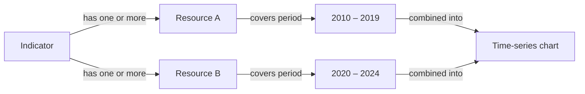

## What is a resource?

A resource is a data source record linked to a specific [indicator](/concepts/indicators). Each resource represents a distinct dataset — typically from a particular organisation or publication — that contributes data points to the indicator's time series.

Resources serve two purposes:

1. **Temporal coverage** — a resource defines the start and end period of the data it provides, making it clear what time range is covered and where gaps may exist
2. **Source attribution** — resources document where the data comes from, supporting transparency and reproducibility

Multiple resources can be linked to a single indicator. This is common when data comes from different organisations over different time periods, or when a methodology changed and separate datasets need to be distinguished.

## Resource fields

| Field | Type | Description |
|---|---|---|
| `id` | string | Unique identifier for the resource |
| `name` | string | Display name identifying the data source |
| `startPeriod` | string | ISO 8601 date marking the start of data coverage |
| `endPeriod` | string | ISO 8601 date marking the end of data coverage |

## Field reference

<ParamField path="body.name" type="string" required>
  A descriptive name for the data source. This typically references the organisation, dataset, or publication that provided the data — for example, `INE Census 2021` or `IPMA Climate Records`.
</ParamField>

<ParamField path="body.startPeriod" type="string" required>
  ISO 8601 date string for the first data point covered by this resource. Example: `2015-01-01`.
</ParamField>

<ParamField path="body.endPeriod" type="string" required>
  ISO 8601 date string for the last data point covered by this resource. Example: `2023-12-31`.

  <Note>
    If a resource covers ongoing data collection with no defined end, administrators typically set `endPeriod` to the date of the most recent data import.
  </Note>
</ParamField>

## Multiple resources per indicator

An indicator may have several resources with non-overlapping or consecutive time periods. This pattern is used when:

- The data source changed over time (e.g. a different institution took over data collection)
- A methodology revision produced a new dataset that replaced an older one
- Data for different sub-periods was collected separately and needs distinct attribution

Example: an indicator tracking annual visitor nights might have:

```json
[
  {
    "id": "res-001",
    "name": "National Statistics Institute — Tourism Survey",
    "startPeriod": "2010-01-01",
    "endPeriod": "2019-12-31"
  },
  {
    "id": "res-002",
    "name": "Regional Tourism Observatory",
    "startPeriod": "2020-01-01",
    "endPeriod": "2024-12-31"
  }
]
```

The platform combines data from all linked resources when rendering the time-series chart, giving a continuous view of the indicator's history.

## Resource API endpoints

Resources have their own CRUD endpoints, and a separate set of endpoints manages the link between a resource and an indicator:

```http
# Resource CRUD
GET    /api/resources                                        # List all resources
GET    /api/resources/:id                                   # Get a resource by ID
POST   /api/resources/                                      # Create a resource (admin)
PUT    /api/resources/:id                                   # Update a resource (admin)
PATCH  /api/resources/:id                                   # Partial update (admin)
DELETE /api/resources/:id                                   # Delete a resource (admin)

# Indicator–resource relationship
GET    /api/indicators/:indicatorId/resources               # List resources linked to an indicator
POST   /api/indicators/:indicatorId/resources               # Link a resource to an indicator
DELETE /api/indicators/:indicatorId/resources/:resourceId   # Unlink a resource from an indicator
```

## Managing resources (admin)

<Warning>
  Resource management requires an administrator account. Deleting a resource removes its associated data points from the indicator's time series — this action cannot be undone.
</Warning>

Administrators manage resources from the `/resources-management/:indicator` route, where `:indicator` is the indicator ID. From this page you can:

- **View** all resources currently linked to the indicator, with their time periods displayed
- **Add** a new resource by providing a name, start period, and end period
- **Edit** an existing resource's name or time period bounds
- **Delete** a resource and its associated data

<Tip>
  When adding a new data source to an existing indicator, check that the new resource's `startPeriod` does not overlap with an existing resource's `endPeriod`. Overlapping periods may produce duplicate or inconsistent data points in the time-series chart.
</Tip>

## Relationship to indicators


